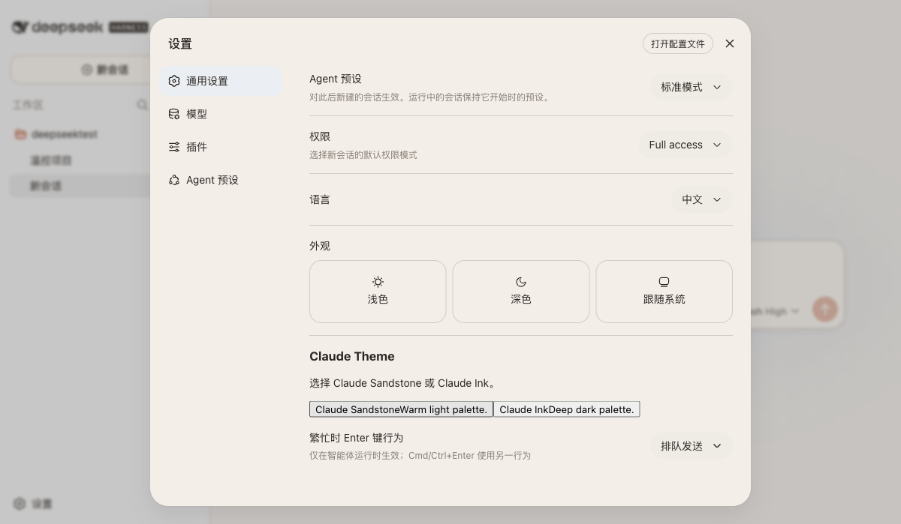
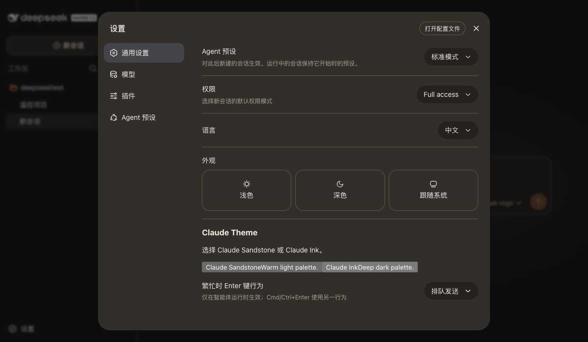

# DeepSeek Claude Web Theme

[简体中文](README.zh-CN.md) · English

`deepseek-claude-web-theme` is a **static DeepSeek Harness (DSH) Web profile
client plugin**. It registers two Claude-inspired appearance themes with a
compatible Harness Web profile:

- `claude-sandstone` — light
- `claude-ink` — dark

It is a browser-side extension, not a standalone Web app and not a replacement
for DeepSeek Harness. Its Node entry is intentionally a no-op; the bundled
client entry waits for the profile's public `theme` service and registers the
two themes through `ctx.theme.register()`.

## Compatibility and scope

Use this only with a DSH Web profile that already composes and enables
`@deepseek-ai/dsh-client-ui-theme`, exposes the public
`ctx.theme.register(definition)` service, and supports DSH client packages in
its Loader/profile configuration. The manifest declares the same client
dependency through `dsh.client.inject`.

This package deliberately has **no npm peer dependency on DSH internals**.
The public npm registry does not provide a complete independently resolvable
DSH client dependency graph, so `npm install deepseek-claude-web-theme` alone
does not create a runnable profile and is not a supported setup path.

The plugin uses only that public theme service; it does not modify Harness core
files. A profile must still decide which registered theme to apply.

## Build and install into an existing profile

Start with a working, compatible DSH Web profile supplied by your own Harness
checkout or deployment. Do not attempt to bootstrap the profile by installing
unpublished DSH packages from npm.

From this package checkout:

```sh
npm ci
npm run bundle
npm pack
```

This creates `deepseek-claude-web-theme-0.1.0.tgz`. From the **configuration
package that anchors your existing DSH profile's dependency resolution**, add
that local archive:

```sh
npm install /absolute/path/to/deepseek-claude-web-theme-0.1.0.tgz
```

Then add `deepseek-claude-web-theme` to that profile's composed Web client
Loader entries, alongside the already-enabled
`@deepseek-ai/dsh-client-ui-theme` package. Preserve the profile's existing
Loader syntax and package-resolution rules; they are owned by the compatible
DSH runtime, not by this plugin. Restart the Web server after changing the
profile configuration or its dependencies.

If the plugin remains parked or reports that `theme` is unavailable, the
profile has not composed the UI-theme client service correctly. Repair or
upgrade that profile first; changing this package will not supply the missing
DSH runtime.

## Selecting a theme

After restart, open the Harness Web **Appearance** settings and choose either
**Claude Sandstone** (`claude-sandstone`) or **Claude Ink** (`claude-ink`). The
theme is registered in the Web process that loads this client. Appearance
selection is therefore process-local: a separate Web process, browser profile,
or environment may keep its own selected theme according to Harness's normal
settings behavior. This plugin does not synchronize that choice between
processes or users.

The selector appears in **Settings → General**, below the built-in appearance
mode. Choosing a Claude theme applies it immediately in the current browser;
the selected button is marked as pressed. The selection is stored by the host
settings service, so its persistence and scope follow that service's normal
browser/profile behavior.

## Gallery

Real DSH Web captures from **Settings → General** with the selected option
shown as pressed:

| Claude Sandstone | Claude Ink |
| --- | --- |
|  |  |

## Privacy and assets

The published package contains JavaScript and type declarations only; its CSS
is bundled into `lib/client.js`. It makes no network requests, collects no user
data, loads no remote fonts, and ships no images or other external assets.
Styling uses that bundled CSS plus the semantic `--dsw-alias-*` tokens supplied
by the profile's theme service.

## Manual Web smoke test

The following test requires a compatible, runnable DSH Web profile; it cannot
be validated from this package alone.

1. Install and compose the package as described above, then restart the DSH
   Web server.
2. Open the Web UI and go to **Appearance**.
3. Confirm both `claude-sandstone` and `claude-ink` are present.
4. Select each theme in turn. Check that the page background, controls,
   composer, code blocks, and conversation/input scrollbars update.
5. Reload the page and confirm the selected theme remains selected according
   to the profile's normal settings behavior.
6. Disable/remove the plugin and restart; confirm the two Claude choices no
   longer appear and an existing built-in theme can be selected.

## Recovery and removal

If a theme is undesirable, first select a built-in theme under **Appearance**.
To remove the plugin, delete `deepseek-claude-web-theme` from the profile's
composed Web client Loader entries, restart the Web server, and remove its
local package dependency from the profile configuration package:

```sh
npm uninstall deepseek-claude-web-theme
```

No core file restoration is needed because this package does not patch Harness
core.

## Development checks

```sh
npm test
npm run typecheck
npm run bundle
npm pack --dry-run
```
